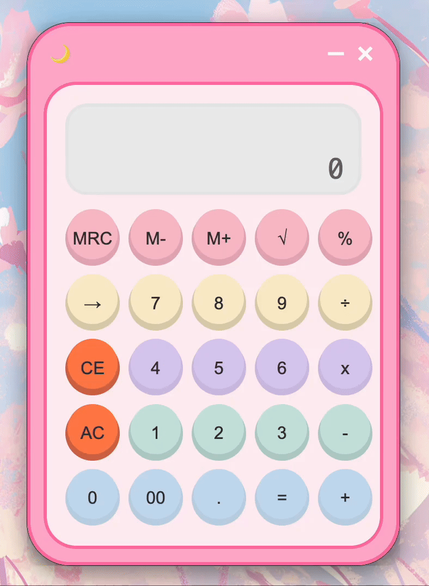

# 🧮 Calculator

A cute and functional desktop calculator built with **Electron + Vite**, featuring a pastel UI, custom window controls, and **a memory system** like old-school calculators.

---

## 🌟 Overview

**Calculator** is a cross-platform desktop app designed with a soft pastel theme and smooth UI.
It combines nostalgic calculator functions (like memory registers) with a modern, minimal interface.

---

## 🎬 Demo



---

## 🎯 Features

- **Custom UI Design:** Fully custom pastel interface inspired by kawaii-style calculators

- **Memory System:** M+, M-, MRC functionality that mimics classic calculator memory behavior

- **Clear Functions:** AC and CE buttons for total or entry-level clearing

- **Mathematical Operations:** +, −, ×, ÷, √, %, and backspace (←)

- **Dynamic Display:** Live updating screen with “M” indicator when memory is active

- **Custom Window Controls:** Top bar with emoji-style moon + minimize & close buttons

- **Fixed Size Window:** 342×498 px window with rounded corners

- **Responsive UI:** Built for macOS using draggable frameless window

- **Cross-Platform:** Works on Windows, macOS, and Linux

---

## 🗂 Application Flow

1. **Welcome Page:** Title screen with "Let's cook your pasta" button  
2. **Pasta Selection:** Choose from bow, spaghetti, fettuccine, or penne with preset cooking times  
3. **Active Timer:** Visual cooking animation with audio feedback and timer controls  
4. **Completion:** "Pasta is ready" notification with option to cook another batch  

---

## 💻 Technology Stack

- **Frontend:** Vanilla JavaScript, HTML, CSS  
- **Framework:** Electron with `electron-vite` for hot reloading  
- **Design:** Custom Figma designs with hand-drawn icons  

---

## ⚙️ Requirements

- Node.js 20.19.0 or higher  
- npm package manager  

---

## 🚀 Installation

```bash
git clone https://github.com/caglaozbb/calculator.git
cd calculator
npm install
```

---

## 🏃‍♂️ Usage

### Development Mode
```bash
npm run dev
```

### Production Mode
```bash
npm start
```

---

## 🛠 Build Commands

- **Development:**  
  ```bash
  npm run dev
  ```  
  Run with hot reloading

- **Preview Production Build:**  
  ```bash
  npm start
  ```

- **Build Production:**  
  ```bash
  npm run build
  ```

- **Platform-specific Builds:**  
  ```bash
  npm run build:win   # Windows
  npm run build:mac   # macOS
  npm run build:linux # Linux
  ```

---

## 🖥 Platform Support

Developed and tested on **macOS**. Cross-platform compatibility expected thanks to Electron.

---

## 📂 Project Structure

Single-page section-based calculator app with a pastel UI, custom top bar, and realistic memory system inspired by physical calculators.
